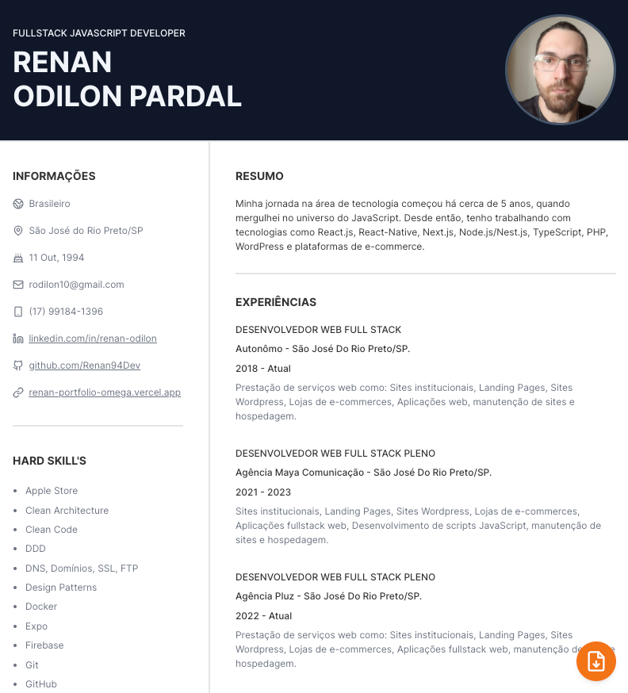

Tudo bem pessoal? Depois de alguma procura por uma maneira de criar um CV online nestes modelos e de forma gratuita, resolvi codar o meu para ter total personalização e de forma gratuita.

Sinta-se livre para editar a seu gosto.

## Começando

Primeiro, rode esses comando no seu terminar:

```bash
npm run prepare && npm run dev
```

E agora, abra [http://localhost:3000](http://localhost:3000) com seu navegador para abrir o visualizar o CV e também salvar o pdf.

Para editar com as suas informações, edite o arquivo `src/data/user.ts`

Você pode editar as cores e mas algumas configurações no arquivo `panda.config.ts` na raiz do projeto.

Projeto desenvolvido com `TypeScript`, `Next.js` e `panda CSS`.
